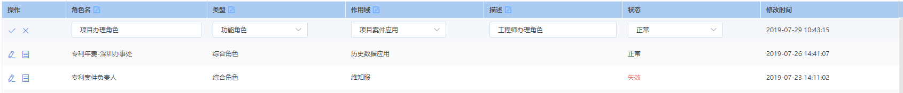

# 可编辑列表组件

## 使用效果图



- **引用**：
```js
import { OperableTable } from '@/components/OperableTable'
```

- **视图**：
```html
<OperableTable :columns="columns" :data="tableData" :checkList="checkList">
    <template slot="operation" slot-scope="{scope}">
        <span v-if="checkList.id!==scope.row.id" class="tb_opts">
            <el-tooltip class="item" effect="dark" content="编辑" placement="top-start">
                <i class="el-icon-edit" @click="() => { checkList = scope.row }"></i>
            </el-tooltip>
        </span>
        <span  class="tb_opts" v-else-if="checkList.id===scope.row.id">
            <i class="el-icon-check" @click="updateRolesSave(scope.row)"></i>
            <i class="el-icon-close" @click="() => { checkList = {} }"></i>
        </span>
    </template>
</OperableTable>
```
```javascript
export default {
    data() {
        return {
            tableData: [{
                id: 100001
                lastUpdateDate: 1564368195000
                name: "项目办理角色"
                status: 0
                type: 1
            }],
            columns: [{
                label: '操作',
                key: 'operation',
                width: 120
            }, {
                label: '角色名',
                key: 'name',
                isEdit: true
            }, {
                label: '类型',
                key: 'type',
                isEdit: true,
                type: 'selected',
                selectList: [
                {
                    name: '综合角色',
                    id: 0
                }, {
                    name: '功能角色',
                    id: 1
                }, {
                    name: '数据角色',
                    id: 2
                }
                ]
            }, {
                label: '状态',
                key: 'status',
                isEdit: true,
                type: 'selected',
                selectList: [
                    { name: '失效', id: -1 },
                    { name: '正常', id: 0 }
                ],
                definedFormat: (list, row) => {
                    return row === -1 ? '<font color="#F56C6C">失效</font>' : '<font>正常</font>'
                }
            }, {
                label: '修改时间',
                key: 'lastUpdateDate',
                type: 'date'
            }],
            checkList: {}
        }
    },
    methods: {
        updateRolesSave (row) {
            // send ajax...
        }
    }
}
```

## Attributes

参数 | 说明 | 类型 | 可选值 | 默认值
- | - | - | - | -
columns | 表头属性 (必填) | Array | ---- | ----
data | 列表数据 (必填) | Array | ---- | ----
checkList | 当前选中的数据 | Object | ---- | ----


## Columns Attributes

参数 | 说明 | 类型 | 可选值 | 默认值
- | - | - | - | -
label | 标题 (必填) | String | ---- | ----
key | 字段标识 (必填) | String | ---- | ----
isEdit | 是否可编辑,传入checkList时才生效 | Boolean | true/false | false
type | 可编辑的表单类型 | String | text/selected/date | text
selectList | 当type: selected时,选项列表数据 | Array | ---- | ----
definedFormat | 自定义格式化函数 | Function | ---- | ----
width | 宽度 | Number | ---- | ----
min-width | 最小宽度 | Number | ---- | ----
align | 对齐方向 | String | left/center/right | left
header-align | 表头对齐方式 | String | ---- | ----


## Slot

参数 | 说明
- | -
---- | 默认tab布局内容

## Events

事件 | 说明 | 回调参数
- | - | -
tab-click | 同el-tab事件 | ----
