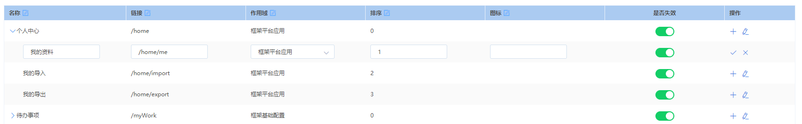

# 可编辑列表组件

## 使用效果图



- **引用**：
```js
import { TreeTable } from '@/components/TreeTable'
```

- **视图**：
```html
<Tree-Table :columns="columns" :data="treeData" :checkList="checkList" defaultChildren="nodeList" :default-expand-all="false">
    <template slot="operation" slot-scope="{scope}">
        <div class="tb_opts">
            <span v-show="checkList.id!==scope.row.id">
                <el-tooltip effect="dark" content="新增" placement="top-start">
                    <i class="el-icon-plus" @click="addBtn(scope.row)"></i>
                </el-tooltip>
                <el-tooltip effect="dark" content="编辑" placement="top-start">
                    <i class="el-icon-edit" @click="editBtn(scope.row)"></i>
                </el-tooltip>
                </span>
                <span v-show="checkList.id===scope.row.id">
                <el-tooltip effect="dark" content="保存" placement="top-start">
                    <i class="el-icon-check" @click="saveBtn"></i>
                </el-tooltip>
                <el-tooltip effect="dark" content="取消" placement="top-start">
                    <i class="el-icon-close" @click="cancelBtn"></i>
                </el-tooltip>
            </span>
        </div>
    </template>
    <template slot="status" slot-scope="{scope}">
        <el-switch v-model="scope.row.status" @change='setStatus(scope.row)' :inactive-value="0" :active-value="1" active-color="#13ce66" inactive-color="#ff4949">
        </el-switch>
    </template>
</Tree-Table>
```

```javascript
export default {
    components: {
        TreeTable
    },
    data() {
        return {
            treeData: [{
                "creationDate":1553604292000,
                "displayText":"个人中心",
                "id":1,
                "lastUpdateDate":1559187742000,
                "level":1,
                "nodeList":[
                    {
                        "creationDate":1553604292000,
                        "displayText":"我的资料",
                        "id":2,
                        "lastUpdateDate":1565345768000,
                        "level":2,
                        "orderNo":1,
                        "parentId":1,
                        "permissionCode":"MenuL2hvbWUvbWU1",
                        "status":1,
                        "treecode":"AAAAACcV",
                        "url":"/home/me"
                    },
                    {
                        "creationDate":1564654607000,
                        "displayText":"我的导入",
                        "id":10105,
                        "lastUpdateDate":1565345774000,
                        "level":1,
                        "orderNo":2,
                        "parentId":1,
                        "status":1,
                        "treecode":"AAAAACcV",
                        "url":"/home/import"
                    },
                    {
                        "creationDate":1564654655000,
                        "displayText":"我的导出",
                        "id":10106,
                        "lastUpdateDate":1564654655000,
                        "level":1,
                        "orderNo":3,
                        "parentId":1,
                        "status":1,
                        "treecode":"AAAAACcV",
                        "url":"/home/export"
                    }
                ],
                "orderNo":0,
                "parentId":0,
                "permissionCode":"MenuL2hvbWU1",
                "status":1,
                "treecode":"AAAAACcV",
                "url":"/home"
            }],
            columns: [{
                label: '名称',
                key: 'displayText',
                align: 'left',
                isEdit: true,
                expand: true
            }, {
                label: '链接',
                key: 'url',
                align: 'left',
                isEdit: true
            }, {
                label: '作用域',
                key: 'treecode',
                align: 'left',
                isEdit: true,
                type: 'selected',
                selectList: []
            }, {
                label: '排序',
                key: 'orderNo',
                align: 'left',
                isEdit: true
            }, {
                label: '图标',
                key: 'icon',
                align: 'left',
                isEdit: true
            }, {
                label: '是否失效',
                key: 'status'
            }, {
                label: '操作',
                key: 'operation',
                align: 'left',
                width: 150
            }],
            checkList: {}
        }
    }
}
```

## Attributes

参数 | 说明 | 类型 | 可选值 | 默认值
- | - | - | - | -
columns | 表头属性 (必填) | Array | ---- | ----
data | 列表数据 (必填) | Array | ---- | ----
checkList | 当前选中的数据 | Object | ---- | ----
defaultExpandAll | 默认是否全部展开 | Boolean | true/false | false
defaultChildren | 指定子树为节点对象的某个属性值 | String | ---- | children
indent | 相邻级节点间的水平缩进，单位为像素 | Number | ---- | 30


## Columns Attributes

参数 | 说明 | 类型 | 可选值 | 默认值
- | - | - | - | -
label | 标题 (必填) | String | ---- | ----
key | 字段标识 (必填) | String | ---- | ----
expand | 是否显示展开收起图标 | Boolean | true/false | false
checkbox | 是否显示`checkbox` | Boolean | true/false | false
isEdit | 是否可编辑,传入checkList时才生效 | Boolean | true/false | false
type | 可编辑的表单类型 | String | text/selected | text
selectList | 当type: selected时,选项列表数据 | Array | ---- | ----
width | 宽度 | Number | ---- | ----
min-width | 最小宽度 | Number | ---- | ----
align | 对齐方向 | String | left/center/right | left
header-align | 表头对齐方式 | String | ---- | ----


## Slot

参数 | 说明
- | -
---- | 默认tab布局内容

## Events

事件 | 说明 | 回调参数
- | - | -
